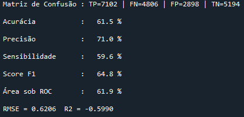

# 1. Introdução
Trabalho 1 de Introdução ao Aprendizado de Máquina. Tem por objetivo a criação de um classificador para apoio à decisão de aprovação de crédito.

# 2. Pré-processamento

O objetivo dessa etapa foi transformar os dados brutos em um conjunto utilizável pelo sistema de treinamento. Para isso, basicamente foi utilizada a função *preprocessing*, a qual buscou realizar nessa ordem:

1) **Formatar os dados**: responsável pelos 'replaces', em que lidou com a ausência de dados. Com exceção do atributo *sexo* (no qual substituiu pela opção existente 'N'), a substituição do vazio foi feita pelo valor na moda do conjunto de dados.
2) **Alterar os dados**: como a informação do local onde nasceu e reside não devem fazer muito impacto no inadimplência, foi criado uma coluna que une essas 2 informações em valores binários que correspondem se a pessoa reside no mesmo local onde nasceu, pois possivelmente seria um parâmetro interessante. 
**Obs**.: Inicialmente também foram agrupadas as localizações por região próxima, mas como o resultado piorou, essa implementação foi deixada de lado.
3) **Realizar a Binarização dos dados**: utilizando a biblioteca *LabelBinarizer*, os parâmetros de verdadeiro ou falso foram transformados em numéricos.
4) **Realizar o ONE-HOTING ENCODER dos dados**: utilizando a função *get_dummies* do pandas, houve o split das opções independentes entre si em novas colunas, possibilitando que haja uma informação binária de cada novo parâmetro.

**Obs**.: Também foi testada a função *Categorical* do pandas para ser um substituto do ONE-HOTING ENCODER (uma vez que a quantidade de novos parâmetros foi gigante), porém, como houve um sistema automático para remoção de atributos impactantes no resultado e a acurácia melhorou com o método tradicional, este foi descartado.  

# 3. Seleção de atributos

Primeiramente, os código de telefone contidos nos parâmetros *codigo_area_telefone_residencial* e *codigo_area_telefone_trabalho* não estavam completos e seria uma informação redundante com outros atributos que já informam a localização da pessoa. Ainda, *estado_onde_trabalha* também entra em redundância com outro atributo que informa a localização. Deste modo, os 3 foram removidos inicialmente.

Continuando em termos de correlação aos parâmetros e visando diminuir mais a redundância, foi criada a função *show_correlation_matrix* que utiliza a biblioteca **seaborn** para plotar um gráfico com uma escala de cor da correlação cruzada entre os parâmetros. Essa função não ajudou muito na redução de dimensões porque indicou poucos parâmetros claramente relacionados, não atuando significativamente na melhora da acurácia do resultado. Visto isso, essa filtragem pela matriz de correlação acabou não sendo aplicada.

Deste modo, foi implementado um trecho de código na função *main* que utililiza a biblioteca **mutual_info_regression** de **feature_selection** presente no **sklearn**, a qual tem por objetivo listar um índice de impacto dos parâmetros com o resultado. Dessa forma, foi feito uma lista com os parâmetros organizados do mais impactantes aos menos. Por fim, os parâmetros que possuiam um impacto maior do que zero não foram removidos dos dados de treinamento do modelo. 

# 4. Implementação
## 4.1. Escolha do modelo preditivo
Como é possível ver no código foram testados 2 classificadores e 8 regressores (na função desenvolvida *predict*, havia uma transformação da resposta final de valores contínuos em binários).

Os **classificadores** testados foram: *KNN* e o *Random Forest Classifier*, mas não apresentaram resultados muito bons assim, partiu-se para a utilização de um regressor com essa conversão final para um resultado final classificado.

Já os **regressores** testados foram: *Linear Regresssion*, *Lasso*, *Ridge*, *SGD*, *Grid Search CV*, *Gradient Boosting Regressor*, *Ada Boost Regressor* e o *Random Forest Regressor*, que aprensetou o melhor resultado.

Essa implementação da função *predict* ocorre verificando o tipo da coluna de inadimplência logo após a predição, onde, se a mesma for do tipo 'float', ocorreu uma regressão e necessita ser convertida para um resultado binário. Assim, há uma lógica que possui um limiar configurado na metade dos limites (0.5). Deste modo, se o valor flutuante for acima de 0.5 é equivalente à 1, caso seja abaixo, equivale a 0.

## 4.2. Script
A modularização tanto das funcionalidades em pequenos blocos, nas condições de treinamento criadas (*validação*: treinamento sem gerar o output do teste; *validação cruzada*: utilizada para alterar os hiperparâmetros; *oficial*: após a definição dos siperparâmetros, gera o output de teste) e nos comentários, facilitando a contextualização, auxiliaram no desenvolvimento otimizado do código. Por certo costume de executar o código completo e também por não consumir tanto tempo, foi escolhido esse método ao invés de explorar as possibilidades de reservar parte do código pré-executada que o console do Spyder oferece.

A lógica de funcionamento geral passou pelas seguintes etapas:

* Recebimento dos dados brutos de input: *get_data*.
* Primeira remoção de parâmetros inúteis: *filter_best_params*
* Pré-processamento (como já explicado acima): *preprocessing*.
* Adição das colunas que o ONE-HOTING ENCODER gerou no teste e não no treino, e vice-versa, para que o modelo possua as mesmas dimensões: *add_difference_param_train_test*. 
**Obs**.: foi testado remover as colunas que não se repetiam, mas o desempenho caiu.
* Mover o target para a última coluna, organizando todos inicialmente em ordem alfabética: função (*reindex*) e *move_overdue_to_end*.
* Divisão de inputs em outputs, junção dos dados de teste com o treino e a realização da padronização da escala.
* Split do treino com o teste, além do treino ser dividido em parte de treino com parte de teste.
* Obtenção do impacto de cada parâmetro com o target, filtrando somente os que possuem uma mínima influência.
* Dependendo da opção de trainamento, o código pode seguir 3 caminhos diferentes como já explicado acima (trainamento de *validação*, *validação cruzada* e *oficial*), no entanto, todos possuem um sistema de ao final, mostrar o resultado obtido localmente.

## 4.3. Ajustes e hiperparâmetros

Basicamente essa funcionalidade ocorreu principalemente nas funções de validação cruzada, por normalmente foi onde implementou-se um loop para variar um certo parâmetro.

No caso do "classificador" com melhor desempenho (Random Forest Regressor), o hiperparâmetro utilizado foi a profundidade da árvore. Tentou-se alterar alguns parâmetros secundários como *max_features*, *min_samples_split*, *min_samples_leaf* e *min_weight_fraction_leaf*, mas não surgiu muito efeito no resultado final.

Deste modo, o hiperparâmetro obtido foi: **depth=7**.

# 5. Análise geral do desempenho

Por fim, executando todo o desenvolvido acima, foi possível obter a seguinte resposta do código:

Figura 1 - Resultado do melhor modelo obtido localmente

É possível notar que o modelo estava relativamente bem treinado, obtendo 61.5% de acurácia e com uma precisão melhor ainda (71%), ambos comparados com os dados de treino. Já com o resultado final de teste (obtido como resposta do Kaggle), o modelo apresentou **acurácia de 58.04%**.